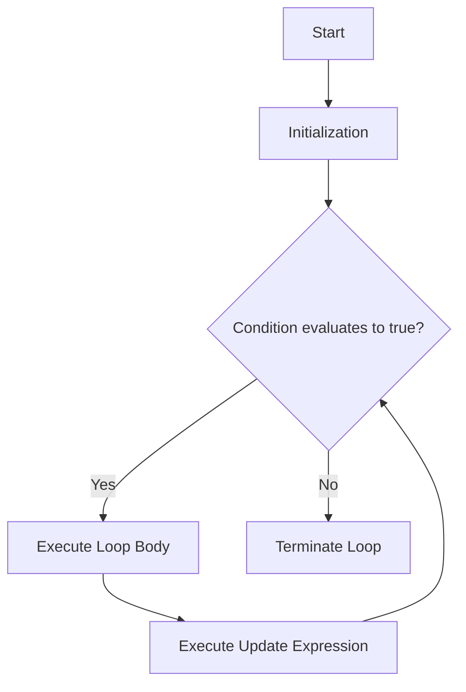

# Java Loop Control Statements

Loops in Java allow repetitive execution of a block of code based on a boolean condition. Interviewers frequently evaluate a developer's understanding of entry-controlled vs. exit-controlled loops, the performance implications of foreach iteration, concurrency issues during iteration, and compilation-level bytecodes.

## 1️⃣ Introduction to Loops in Java

Java provides four primary loop constructs:
1. **`for` Loop** – Entry-controlled; best when the number of iterations is known beforehand.
2. **`while` Loop** – Entry-controlled; best when iterating until a dynamic condition is met.
3. **`do-while` Loop** – Exit-controlled; executes the loop body at least once.
4. **Enhanced `for` Loop (For-Each)** – Entry-controlled; designed specifically for array and collection traversal.

---

## 2️⃣ The Three Classic Loop Structures

### Traditional `for` Loop
Executes a block of code repeatedly while checking a loop control variable.
```java
for (initialization; condition; update) {
    // Body of the loop
}
```

#### Detailed Execution Sequence:


#### Key Characteristics & Interview Insights:
* **All Parts are Optional**: All three sections in the loop header are optional. A valid infinite loop is written as:
  ```java
  for (;;) {
      // Infinite loop
  }
  ```
* **Comma Operator (`,`) Support**: You can initialize and update multiple variables of the *same* type in the header.
  ```java
  for (int i = 0, j = 10; i < j; i++, j--) {
      System.out.println(i + " : " + j);
  }
  ```
  > [!WARNING]
  > You cannot declare variables of different types in the loop initialization block.
  > ```java
  > // ❌ COMPILE ERROR: Syntax error on token ",", ; expected
  > for (int i = 0, double d = 0.0; i < 10; i++) { }
  > ```

---

### The `while` Loop
An entry-controlled loop that tests the condition *before* executing the loop body.
```java
while (condition) {
    // Body of the loop
}
```

* **Strict Boolean Requirement**: Similar to `if`, the condition expression must strictly evaluate to a `boolean` (or its wrapper `Boolean`).
* **Dynamic Condition Usage**: Ideal for situations where the terminal state is dependent on external input, file reading (`BufferedReader.readLine() != null`), or server sockets.

---

### The `do-while` Loop
An exit-controlled loop that executes the block of code *first*, and then tests the condition.
```java
do {
    // Body of the loop
} while (condition); // ⚠️ Semicolon is mandatory!
```

* **Guaranteed Execution**: The loop body is guaranteed to execute **at least once** because the condition is evaluated after the block execution.
* **Common Use Case**: Interactive menu-driven CLI applications where the menu should display at least once before requesting user selection.

---

## 3️⃣ The Enhanced `for` Loop (For-Each)

Introduced in Java 5, the enhanced `for` loop simplifies collection and array traversal by removing the need for index manipulation.
```java
for (Type element : iterableOrArray) {
    // Body
}
```

### Under the Hood Compilation
The compiler translates the enhanced `for` loop differently depending on the data source:

#### 1. Traversal over Arrays:
Translates to a standard, index-based `for` loop:
```java
// Written:
for (int num : array) { System.out.println(num); }

// Compiled:
for (int i = 0; i < array.length; i++) {
    int num = array[i];
    System.out.println(num);
}
```

#### 2. Traversal over Collections:
Translates into an iterator-based loop:
```java
// Written:
for (String s : list) { System.out.println(s); }

// Compiled:
Iterator<String> iterator = list.iterator();
while (iterator.hasNext()) {
    String s = iterator.next();
    System.out.println(s);
}
```

### ⚠️ Enhanced For-Each Restrictions & Traps

#### 1. Modification Restriction (Concurrent Modification)
Modifying the structure of a collection (adding or removing elements) while traversing it via a for-each loop triggers a `ConcurrentModificationException`.
```java
List<String> list = new ArrayList<>(List.of("A", "B", "C"));
for (String val : list) {
    if (val.equals("B")) {
        list.remove(val); // ❌ Throws ConcurrentModificationException at runtime
    }
}
```
> [!TIP]
> **To resolve this:** Use an explicit [Iterator](https://docs.oracle.com/en/java/javase/21/docs/api/java.base/java/util/Iterator.html) and call its `.remove()` method, or use Java 8's `.removeIf()` method:
> ```java
> list.removeIf(val -> val.equals("B"));
> ```

#### 2. Read-Only Reference Trap
You cannot modify primitive array elements or reassign references in a for-each loop.
```java
int[] nums = {1, 2, 3};
for (int val : nums) {
    val = val * 10; // Only changes local loop variable copy
}
// nums remains [1, 2, 3]
```

---

## 4️⃣ Jump Statements: `break`, `continue`, and Labeled Loops

### `break` vs. `continue`
* **`break`**: Immediately terminates the enclosing loop, moving control flow to the first statement following the loop.
* **`continue`**: Skips the remaining statements in the current iteration of the loop and starts the next iteration.

> [!IMPORTANT]
> **The `continue` Execution Difference**:
> * In a **`for` loop**, `continue` jumps to the **update expression** (`i++`), then to the condition check.
> * In a **`while` or `do-while` loop**, `continue` jumps **directly** to the condition check. If loop updates are inside the body below the `continue`, they will be bypassed, resulting in an infinite loop!

### Labeled Loops
Java supports labels to target a specific loop for a `break` or `continue` when dealing with nested structures.
```java
outerLoop: // Label
for (int i = 0; i < 3; i++) {
    for (int j = 0; j < 3; j++) {
        if (i == 1 && j == 1) {
            break outerLoop; // Terminates the outerLoop directly
        }
        System.out.println(i + "," + j);
    }
}
```

---

## 5️⃣ ⚠️ Critical Interview Tricky Points & Gotchas

### 1. Unreachable Code compilation errors
Java compilers strictly flag statements that are statically determined to be unreachable.
```java
// ❌ COMPILE ERROR: Unreachable code
while (false) {
    System.out.println("Hello");
}
```
However, the compiler treats `if (false)` as a special case for conditional compiling (e.g. debugging switches), so it is allowed.

Also, statements immediately following an infinite loop cause compilation errors:
```java
while (true) {
    // infinite loop
}
System.out.println("Finished"); // ❌ COMPILE ERROR: Unreachable code
```

### 2. Numeric Overflow Loop Trap
Looping variable limits can overflow, causing an infinite loop.
```java
// What happens here?
for (byte b = 0; b < 128; b++) {
    System.out.println(b);
}
```
> [!CAUTION]
> This leads to an **infinite loop**. A `byte` variable has a maximum value of `127`. When `b` reaches `127`, the increment operator `b++` overflows it to `-128`, which is still less than `128`.

### 3. Floating Point Precision Issue
Using floats/doubles as loop counters can cause rounding issues, making strict comparisons unreliable.
```java
// Danger: May run infinitely
for (double d = 0.0; d != 1.0; d += 0.1) {
    System.out.println(d);
}
```
Binary floating point representations cannot represent `0.1` precisely, causing `d` to skip `1.0` (e.g., `0.9999999999999999` then `1.0999999999999999`).

### 4. Local Variable Scope
Variables declared inside the initialization block are scoped exclusively to the loop body.
```java
for (int i = 0; i < 10; i++) {}
System.out.println(i); // ❌ COMPILE ERROR: i cannot be resolved to a variable
```

---

## 6️⃣ Performance & Compilation: Under the Hood

### Bytecode Representation
Under the hood, the JVM implements loops using jump instructions such as:
* `goto` (unconditional jump)
* Relational branches (e.g., `if_icmpge` - jump if integer comparison greater than or equal)

Consider this loop:
```java
for (int i = 0; i < 5; i++) {
    System.out.println(i);
}
```
Translates to bytecode resembling:
```bytecode
 0: iconst_0            // Push 0 onto operand stack
 1: istore_1            // Pop and store in local variable index 1 (i = 0)
 2: iload_1             // Load local variable 1
 3: iconst_5            // Push 5 onto stack
 4: if_icmpge     22    // If i >= 5, jump to instruction 22 (exit loop)
 7: getstatic     #2    // Field java/lang/System.out:Ljava/io/PrintStream;
10: iload_1             // Load i
11: invokevirtual #3    // Method java/io/PrintStream.println:(I)V
14: iinc          1, 1  // Increment local variable 1 by 1 (i++)
17: goto          2     // Jump back to instruction 2 (check condition)
22: return              // End method
```

### JIT Compiler Optimizations:
1. **Loop Unrolling**: The JIT compiler duplicates the body of a loop to reduce jump operations, which improves execution pipeline performance.
2. **Dead Loop Elimination**: If a loop does not modify the application state (e.g., empty loop `for (int i=0; i<10000; i++);` without side effects), the compiler removes it entirely.

---

## 7️⃣ High-Yield Interview Questions & Solutions

### Q1: What is the output of the following code?
```java
int i = 0;
for (System.out.print("A"); i < 2; System.out.print("C")) {
    i++;
    System.out.print("B");
}
```
**Answer:** `ABCBC`
**Explanation:** 
1. The initialization expression runs first: Prints `A`.
2. The condition `i < 2` (0 < 2) is evaluated (`true`).
3. The loop body executes: `i` becomes `1`, and prints `B`.
4. The update expression runs: Prints `C`.
5. The condition `i < 2` (1 < 2) is evaluated (`true`).
6. The loop body executes: `i` becomes `2`, and prints `B`.
7. The update expression runs: Prints `C`.
8. The condition `i < 2` (2 < 2) evaluates to `false`. Loop terminates.
Combining all printed characters: `A` -> `B` -> `C` -> `B` -> `C` = `ABCBC`.

---

### Q2: Will the following code compile?
```java
int x = 0;
for (x = 0; x < 5; x++) 
    int temp = x * 2;
```
**Answer:** No, it results in a compile-time error.
**Explanation:** Java prohibits declaring variables directly within conditional or loop statements without curly braces `{}`. A variable declared inside a single-statement block cannot be used anywhere else since its scope immediately expires, so the language compiler disallows this code pattern.

---

### Q3: What is the output of the following code?
```java
int count = 0;
outer:
for (int i = 0; i < 3; i++) {
    for (int j = 0; j < 3; j++) {
        if (i == j) {
            continue outer;
        }
        count++;
    }
}
System.out.println(count);
```
**Answer:** `3`
**Explanation:** 
* `i = 0`: Inner loop starts at `j = 0`. Since `i == j` (0 == 0), `continue outer` triggers. The rest of the inner loop is skipped, outer loop moves to `i = 1`.
* `i = 1`:
  * `j = 0`: `i != j`. `count` becomes `1`.
  * `j = 1`: `i == j`. `continue outer` triggers. Outer loop moves to `i = 2`.
* `i = 2`:
  * `j = 0`: `i != j`. `count` becomes `2`.
  * `j = 1`: `i != j`. `count` becomes `3`.
  * `j = 2`: `i == j`. `continue outer` triggers. Outer loop terminates because `i < 3` is no longer true.
Final `count` value is `3`.

---

### Q4: Explain the compile-time differences between `while (false)` and `while (flag)` where `flag` is a boolean set to `false`.
```java
// Case 1
while (false) {
    System.out.println("Hello"); // ❌ Compile error: Unreachable code
}

// Case 2
boolean flag = false;
while (flag) {
    System.out.println("Hello"); //  Compiles successfully (never runs)
}
```
**Answer:**
* **Case 1**: The expression `false` is a compile-time constant. The compiler does constant folding and analysis, identifying that the loop body will never be executed, and reports an "Unreachable code" error.
* **Case 2**: The expression is a variable (`flag`). Even though it is initialized to `false`, the compiler does not guarantee that the value won't change dynamically during runtime execution (unless it's declared `final`). Therefore, it does not mark the body as unreachable, and the code compiles successfully.

---

### Q5: What is the output of this code snippet?
```java
List<Integer> list = List.of(1, 2, 3);
for (Integer x : list) {
    x = x + 10;
}
System.out.println(list);
```
**Answer:** `[1, 2, 3]`
**Explanation:** The for-each loop assigns each element's reference to the loop variable `x`. When executing `x = x + 10`, the local variable `x` is updated to point to a newly created `Integer` object. The original list is immutable and remains completely unmodified.

---

### Q6: Can a continue statement result in an infinite loop in a while construct? Provide an example.
**Answer:** Yes, if the loop control variable update is written inside the loop body after the `continue` statement.
```java
int i = 0;
while (i < 5) {
    if (i == 2) {
        continue; // Bypasses the i++ statement below
    }
    i++;
}
```
When `i` becomes `2`, the condition `i == 2` evaluates to `true`, and `continue` triggers. The control flow returns directly to the `while(i < 5)` check without running `i++`. Thus, `i` remains `2` infinitely.

---

### Q7: What is the output of this do-while loop?
```java
int i = 1;
do {
    i--;
} while (i > 1);
System.out.println(i);
```
**Answer:** `0`
**Explanation:** 
1. The block executes first without evaluation. `i` is decremented from `1` to `0`.
2. The condition `i > 1` (0 > 1) is evaluated (`false`).
3. Loop terminates.
4. Output is `0`.

---

## Summary Checklist for Interviews
* [ ] Explain the difference between entry-controlled (`for`, `while`) and exit-controlled (`do-while`) loops.
* [ ] Understand variable scoping inside `for` loop headers.
* [ ] Describe the underlying compilation of the enhanced `for` loop (arrays vs `Iterable`).
* [ ] Recognize standard iteration exception gotchas, specifically `ConcurrentModificationException`.
* [ ] Avoid floating point counts in loop criteria.
* [ ] Explain labeled break/continue statements and trace nested loops accurately.
* [ ] Analyze compile-time constant checking for unreachable code behavior.
* [ ] Explain how bytecode instructions (`goto`, `if_icmpge`) represent loops.